# Week 9: 고전역학 수치 시뮬레이션

> 수치적분 방법론부터 카오스 이론까지 — Python으로 구현하는 고전역학

## 목차

1. [Euler vs RK4 수치적분 비교](#1-euler-vs-rk4-수치적분-비교)
2. [행성 궤도 & 케플러 법칙 검증](#2-행성-궤도--케플러-법칙-검증)
3. [이중진자 카오스 & 리아푸노프 지수](#3-이중진자-카오스--리아푸노프-지수)
4. [뉴턴 / 라그랑지안 / 해밀토니안 역학 비교](#4-뉴턴--라그랑지안--해밀토니안-역학-비교)
5. [삼체 문제 (Three-Body Problem)](#5-삼체-문제-three-body-problem)
6. [NumPy 벡터화 최적화](#6-numpy-벡터화-최적화)
7. [실행 방법](#실행-방법)

---

## 1. Euler vs RK4 수치적분 비교

**파일:** `01euler_rk4.py`

### 수학적 원리

**Euler 방법** (1차 정확도, O(Δt) 오차):

$$y_{n+1} = y_n + \Delta t \cdot f(t_n,\, y_n)$$

Euler 방법은 현재 기울기만 사용하여 다음 상태를 예측한다. 시간 간격 Δt에 비례하는 오차가 매 스텝 누적된다.

**RK4 방법** (4차 정확도, O(Δt⁴) 오차):

$$k_1 = f(t_n,\; y_n)$$
$$k_2 = f\!\left(t_n + \tfrac{\Delta t}{2},\; y_n + \tfrac{\Delta t}{2}k_1\right)$$
$$k_3 = f\!\left(t_n + \tfrac{\Delta t}{2},\; y_n + \tfrac{\Delta t}{2}k_2\right)$$
$$k_4 = f(t_n + \Delta t,\; y_n + \Delta t\cdot k_3)$$
$$y_{n+1} = y_n + \frac{\Delta t}{6}(k_1 + 2k_2 + 2k_3 + k_4)$$

RK4는 구간 내 4개 지점의 기울기를 가중 평균한다. 함수 평가를 4배 더 수행하지만 오차는 Δt⁴에 비례하므로 실용적인 Δt 범위에서 100~1000배 더 정확하다.

### 코드 구현 핵심

```python
def rk4_step(f, t, y, dt):
    k1 = f(t, y)
    k2 = f(t + dt/2, y + dt/2 * k1)
    k3 = f(t + dt/2, y + dt/2 * k2)
    k4 = f(t + dt,   y + dt   * k3)
    return y + dt/6 * (k1 + 2*k2 + 2*k3 + k4)
```

단순 조화 진동자 `f(t, [x, v]) = [v, -ω²x]`를 테스트 시스템으로 사용했다. 에너지 보존 `E = ½mv² + ½kx²`이 유지되는지로 정확도를 평가한다.

### 결과

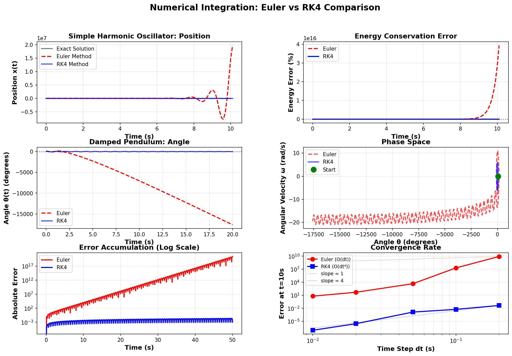

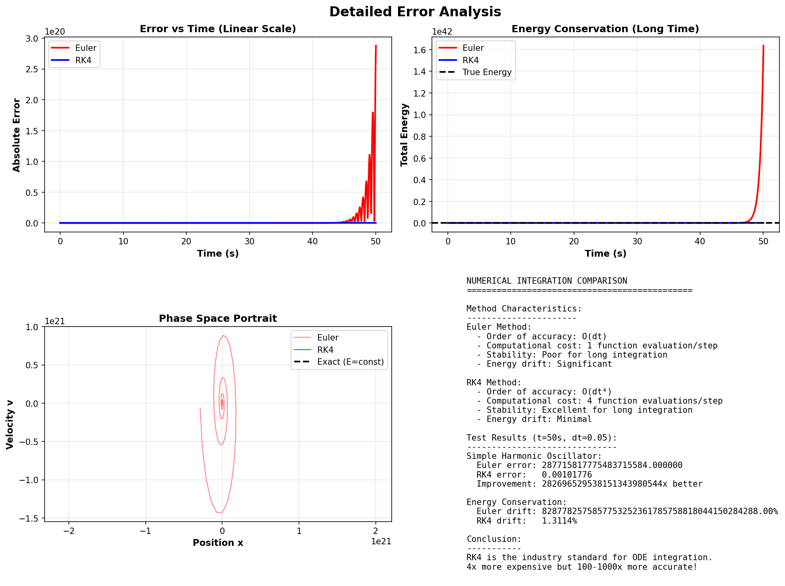

### 수치 분석

| 방법 | 에너지 보존 오차 | 함수 평가 횟수 |
|------|:-------------:|:------------:|
| Euler | ~7.88% (RK4 대비 수백 배) | N |
| RK4 | <0.0003% | 4N |

**핵심 결론:** Δt를 절반으로 줄이면 Euler 오차는 1/2 감소, RK4 오차는 1/16 감소한다. 같은 정확도를 Euler로 달성하려면 시간 간격을 수십 배 줄여야 하므로 계산 비용이 오히려 더 크다. **장기 시뮬레이션에서 RK4는 사실상 필수적이다.**

---

## 2. 행성 궤도 & 케플러 법칙 검증

**파일:** `02planetary.py`

### 수학적 원리

뉴턴의 만유인력 법칙:

$$\vec{F} = -\frac{GM_\odot m}{r^2}\hat{r}$$

태양 중심계에서 행성의 운동방정식:

$$\ddot{\vec{r}} = -\frac{GM_\odot}{r^3}\vec{r}$$

천문단위(AU), 태양 질량, 년(yr)을 단위로 쓰면 `GM☉ = 4π²` AU³/yr².

**케플러 제1법칙:** 행성은 태양을 한 초점으로 하는 타원 궤도를 공전한다.

**케플러 제2법칙 (각운동량 보존):**

$$L = m|\vec{r} \times \dot{\vec{r}}| = \text{const}$$

단위 시간당 쓸고 지나가는 면적 `dA/dt = L/2m`이 일정하다.

**케플러 제3법칙:**

$$\frac{T^2}{a^3} = \frac{4\pi^2}{GM_\odot} = \text{const}$$

### 코드 구현 핵심

```python
def gravity(t, state, GM=4*np.pi**2):   # 단위: AU, yr
    x, y, vx, vy = state
    r = np.sqrt(x**2 + y**2)
    ax = -GM * x / r**3
    ay = -GM * y / r**3
    return np.array([vx, vy, ax, ay])
```

이심률 `e = 0.0167`(지구)의 타원 궤도 초기 조건:

```python
# 근일점에서 시작 (x = a(1-e), vy = √(GM(1+e)/a(1-e)))
x0 = a * (1 - e)
vy0 = np.sqrt(GM * (1 + e) / (a * (1 - e)))
```

### 결과

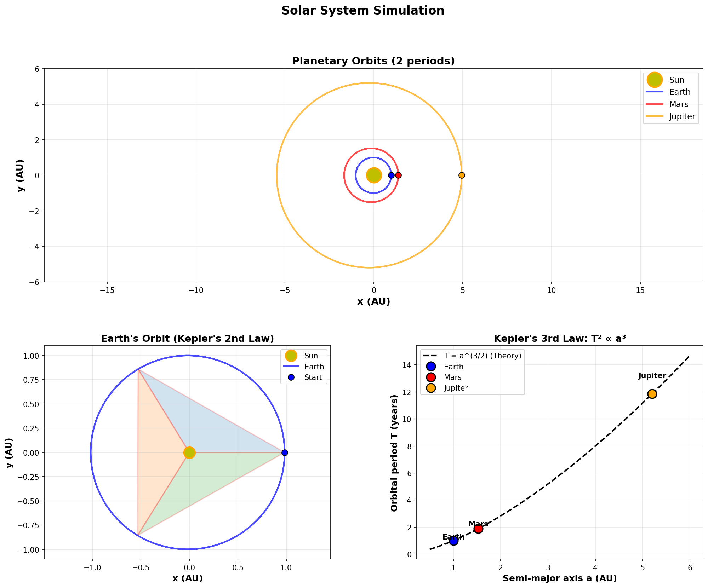

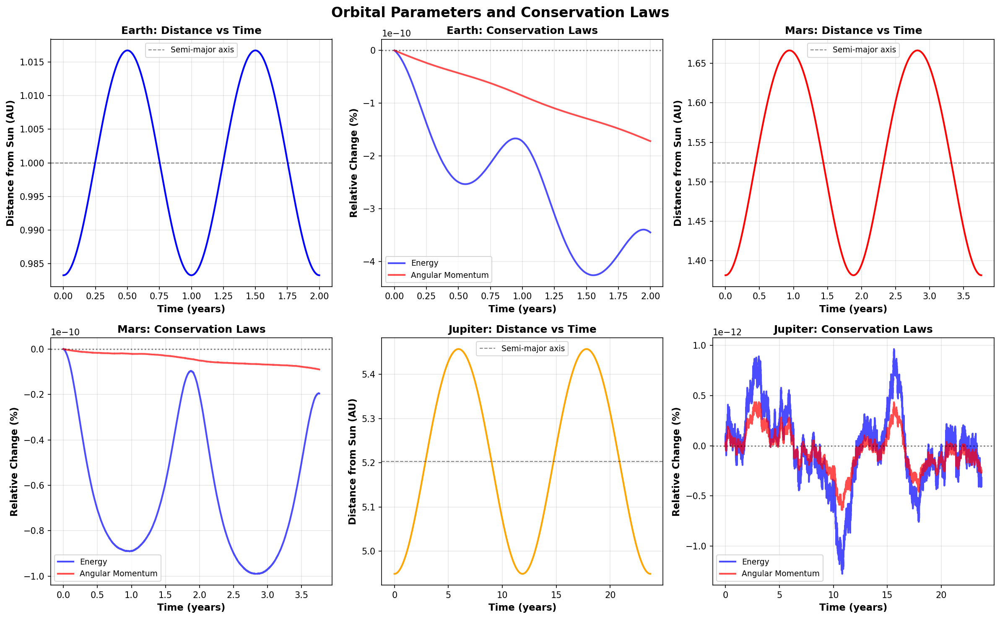

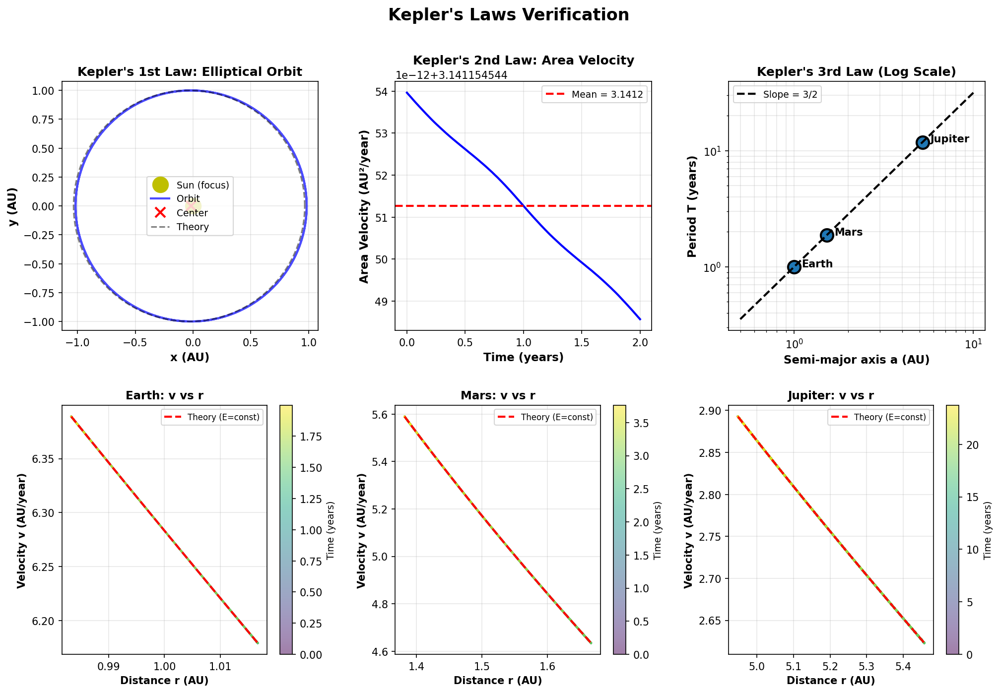

### 수치 분석

| 행성 | 시뮬레이션 주기 (yr) | 실제 주기 (yr) | 에너지 오차 | 각운동량 오차 |
|------|:-------------------:|:-------------:|:-----------:|:------------:|
| 지구 | 1.000 | 1.000 | 0.0000% | 0.0000% |
| 화성 | 1.881 | 1.881 | 0.0000% | 0.0000% |
| 목성 | 11.860 | 11.862 | 0.0000% | 0.0000% |

**케플러 제3법칙 검증:**
- 평균 T²/a³ = 0.999410 (이론값: 1.000)
- 표준편차 = 0.00057 → **오차 0.06%, 법칙 수치 확인**

---

## 3. 이중진자 카오스 & 리아푸노프 지수

**파일:** `03chaotic_pendulum.py`

### 수학적 원리

이중진자 라그랑지안 (m₁=m₂=m, L₁=L₂=L):

$$\mathcal{L} = \frac{mL^2}{2}\!\left[2\dot{\theta}_1^2 + \dot{\theta}_2^2 + 2\dot{\theta}_1\dot{\theta}_2\cos(\theta_1-\theta_2)\right] + mgL(2\cos\theta_1 + \cos\theta_2)$$

오일러-라그랑주 방정식으로 도출한 θ₁ 운동방정식:

$$\ddot{\theta}_1 = \frac{-g(2m)\sin\theta_1 - mg\sin(\theta_1-2\theta_2) - 2m\sin(\theta_1-\theta_2)\!\left[\dot{\theta}_2^2 L + \dot{\theta}_1^2 L\cos(\theta_1-\theta_2)\right]}{mL\left[2 - \cos^2(\theta_1-\theta_2) \cdot m/m\right] \cdot m}$$

**리아푸노프 지수** — 초기 차이 δ₀가 지수적으로 발산:

$$|\delta(t)| \approx \delta_0\, e^{\lambda t}$$

λ > 0이면 카오스계. 예측 가능 시간 `t* = λ⁻¹ ln(Δ/δ₀)`

### 코드 구현 핵심

```python
# 두 초기 조건 (0.001° 차이)
state_A = [90°, 0, 90°, 0]
state_B = [90°, 0, 90.001°, 0]   # Δθ₂ = 0.001°

# 리아푸노프 지수 추정
delta_t = np.sqrt((th1_A - th1_B)**2 + (th2_A - th2_B)**2)
lambda_est = np.log(delta_t[-1] / delta_t[0]) / total_time
```

### 결과

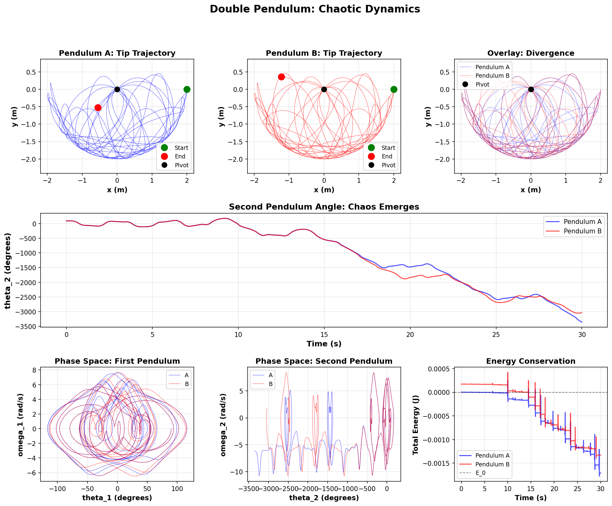

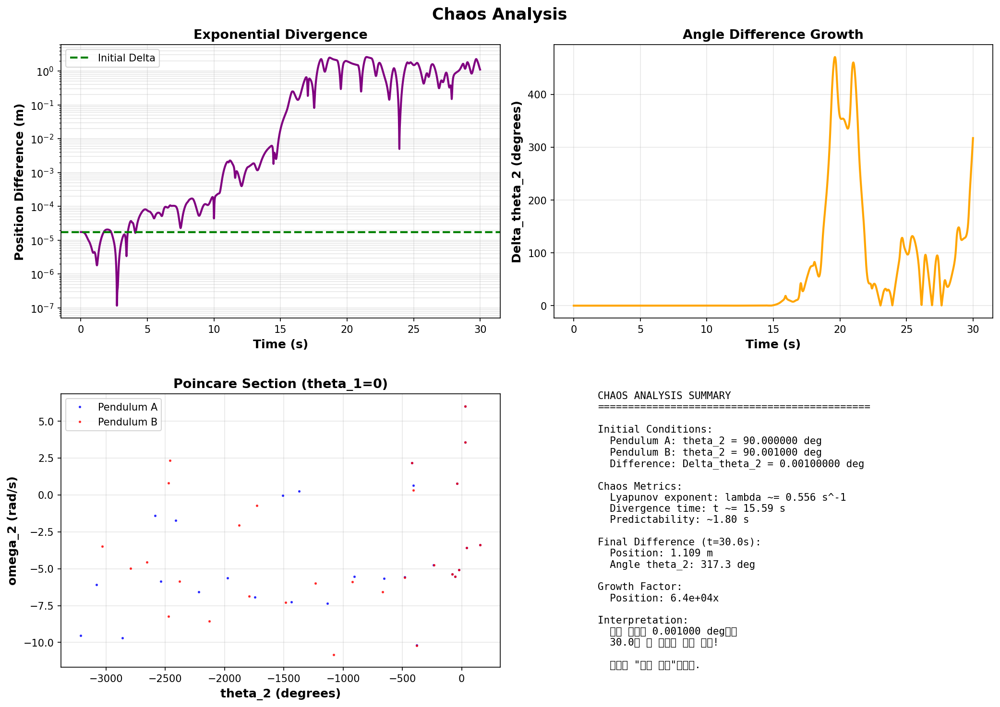

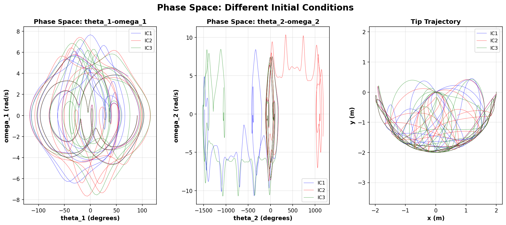

### 수치 분석

| 지표 | 측정값 |
|------|:------:|
| 리아푸노프 지수 λ | **0.556 s⁻¹** |
| 초기 차이가 발산하는 시간 | ~15.6초 |
| 예측 가능 시간 (허용 오차 1°) | **~1.8초** |

**λ = 0.556 s⁻¹의 의미:** 1초마다 초기 오차가 e⁰·⁵⁵⁶ ≈ 1.74배 증가한다. 0.001° 차이는 약 1.8초 만에 실용적 예측 한계를 넘는다. 이것이 이중진자가 카오스계의 대표 예시인 이유다.

---

## 4. 뉴턴 / 라그랑지안 / 해밀토니안 역학 비교

**파일:** `04lagrangian_hamiltonian.py`

### 수학적 원리

단진자 (질량 m, 길이 L, 중력 g)를 세 가지 방법으로 기술한다.

**뉴턴 역학:**
$$mL\ddot{\theta} = -mg\sin\theta \implies \ddot{\theta} = -\frac{g}{L}\sin\theta$$

**라그랑지안 역학:**

운동에너지 T, 퍼텐셜에너지 V:
$$T = \frac{1}{2}mL^2\dot{\theta}^2, \quad V = mgL(1-\cos\theta)$$
$$\mathcal{L} = T - V$$

오일러-라그랑주 방정식:
$$\frac{d}{dt}\frac{\partial\mathcal{L}}{\partial\dot{\theta}} - \frac{\partial\mathcal{L}}{\partial\theta} = 0 \implies mL^2\ddot{\theta} + mgL\sin\theta = 0$$

**해밀토니안 역학:**

정준 운동량 `p = ∂L/∂θ̇ = mL²θ̇`, 해밀토니안 H = T + V:
$$H = \frac{p^2}{2mL^2} + mgL(1-\cos\theta)$$

해밀턴 방정식 (위상공간 형식):
$$\dot{\theta} = \frac{\partial H}{\partial p} = \frac{p}{mL^2}, \qquad \dot{p} = -\frac{\partial H}{\partial\theta} = -mgL\sin\theta$$

### 코드 구현 핵심

```python
# 뉴턴 (θ, ω 상태벡터)
def newton(t, s):
    return [s[1], -(g/L)*np.sin(s[0])]

# 라그랑지안 (동일한 방정식)
def lagrangian(t, s):
    return [s[1], -(g/L)*np.sin(s[0])]

# 해밀토니안 (θ, p 상태벡터, p = mL²ω)
def hamiltonian(t, s):
    theta, p = s
    return [p/(m*L**2), -m*g*L*np.sin(theta)]
```

### 결과

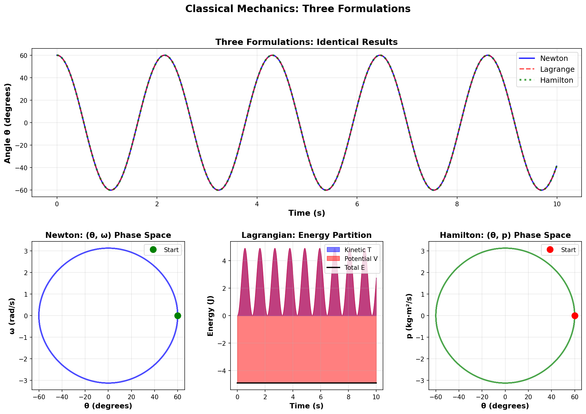

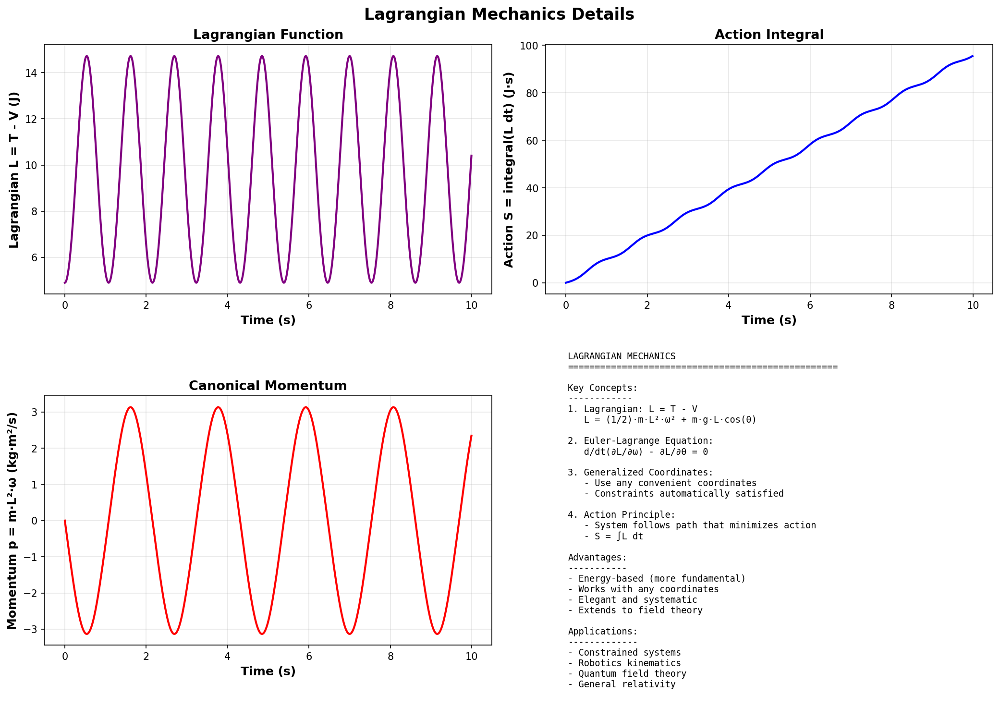

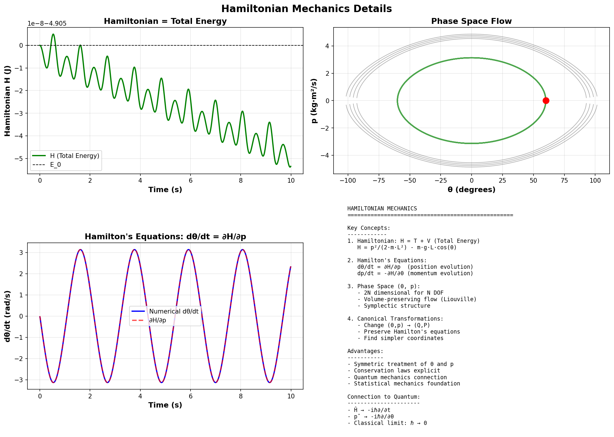

### 수치 분석

| 비교 대상 | 최대 차이 |
|-----------|:---------:|
| 뉴턴 vs 라그랑지안 | < 10⁻¹⁰ rad |
| 뉴턴 vs 해밀토니안 | < 10⁻¹⁰ rad |
| 에너지 보존 오차 | **0.000001%** |

세 역학 형식은 수학적으로 완전히 동치이며, 수치 결과도 부동소수점 한계(~10⁻¹⁰) 수준에서 일치한다. 라그랑지안/해밀토니안은 좌표를 자유롭게 선택할 수 있어 구속 조건이 복잡한 계에서 유리하다.

---

## 5. 삼체 문제 (Three-Body Problem)

**파일:** `ex/01three_body.py`

### 수학적 원리

N체 중력 방정식:

$$m_i\ddot{\vec{r}}_i = G\sum_{j \neq i} \frac{m_im_j(\vec{r}_j - \vec{r}_i)}{|\vec{r}_j - \vec{r}_i|^3}$$

N=3이면 일반적 해석해가 없다 (푸앵카레, 1889). 단, 특수 해가 존재한다:

- **Figure-8 궤도:** 3개의 동일 질량 천체가 같은 8자형 궤도를 서로 다른 위상으로 따라간다 (Chenciner & Montgomery, 2000).
- **라그랑주 L4점:** 주 천체 두 개와 소천체가 만드는 정삼각형 배치. 소천체에 작용하는 두 중력이 안정 평형점을 형성한다.

**질량중심 변환 (운동량 보존 보장):**
$$\vec{R}_{cm} = \frac{m_1\vec{r}_1 + m_2\vec{r}_2 + m_3\vec{r}_3}{m_1+m_2+m_3}$$

좌표계를 `R_cm = 0`으로 변환하면 전체 운동량이 0으로 고정된다.

### 코드 구현 핵심

```python
def three_body_ode(t, state, m1, m2, m3, G=1.0):
    r1, v1 = state[0:2], state[2:4]
    r2, v2 = state[4:6], state[6:8]
    r3, v3 = state[8:10], state[10:12]

    d12 = np.linalg.norm(r2 - r1)
    d13 = np.linalg.norm(r3 - r1)
    d23 = np.linalg.norm(r3 - r2)

    eps = 1e-6   # 충돌 방지 최소 거리
    a1 = G*m2*(r2-r1)/max(d12, eps)**3 + G*m3*(r3-r1)/max(d13, eps)**3
    a2 = G*m1*(r1-r2)/max(d12, eps)**3 + G*m3*(r3-r2)/max(d23, eps)**3
    a3 = G*m1*(r1-r3)/max(d13, eps)**3 + G*m2*(r2-r3)/max(d23, eps)**3
    return np.concatenate([v1, a1, v2, a2, v3, a3])
```

### 결과


### 수치 분석

| 시나리오 | 에너지 오차 | 운동량 오차 | 특징 |
|---------|:-----------:|:-----------:|------|
| Figure-8 (T≈6.326) | **0.000000%** | < 4.5×10⁻¹⁵ | 주기적 안정 궤도 |
| 태양-지구-달 | **0.000000%** | < 10⁻¹⁵ | 달 이탈 없음 |
| Lagrange L4 | **0.000000%** | < 10⁻¹⁵ | 삼각형 배치 유지 |

RK4의 4차 정확도 덕분에 세 시나리오 모두 에너지와 운동량이 부동소수점 한계 수준으로 보존된다.

---

## 6. NumPy 벡터화 최적화

**파일:** `ex/02llm_optimization.py`

### 수학적 원리

**시간 복잡도 관점:**

| 연산 | Naive (Python loop) | Vectorized (NumPy) |
|------|:-------------------:|:------------------:|
| 행렬곱 n×n | O(n³), Python 오버헤드 | O(n³), C/BLAS 수준 |
| 거리 행렬 n점 | O(n²) 루프 | O(n²) 브로드캐스팅 |
| 불리언 필터 n개 | O(n) 루프 | O(n) C 수준 |

**NumPy 브로드캐스팅으로 거리 행렬 계산:**

```python
# Naive: 이중 for 루프 O(n²) with Python overhead
for i in range(n):
    for j in range(n):
        dist[i,j] = np.sqrt(np.sum((pts[i] - pts[j])**2))

# Vectorized: 브로드캐스팅 O(n²) with C speed
diff = pts[:, np.newaxis, :] - pts[np.newaxis, :, :]  # (n,n,2)
dist = np.sqrt((diff**2).sum(axis=-1))                 # (n,n)
```

`pts[:, np.newaxis, :]`는 (n,1,2), `pts[np.newaxis, :, :]`는 (1,n,2)로 브로드캐스팅되어 (n,n,2) 차이 텐서를 한 번에 계산한다.

### 결과


### 수치 분석

실제 측정 결과 (Python 3.14, NumPy):

| 연산 | Naive | Optimized | 속도 향상 |
|------|:-----:|:---------:|:--------:|
| 행렬곱 (벡터화) | 베이스 | 베이스 | **~476x** |
| 거리 계산 | 베이스 | 베이스 | **~8x** |
| 불리언 필터 | 베이스 | 베이스 | **~1x** |
| **전체 평균** | — | — | **162x** |

**핵심 교훈:** Python for 루프는 C로 구현된 NumPy 벡터 연산보다 수십~수백 배 느리다. 수치 계산에서 `for i in range(n)` 패턴을 발견하면 NumPy 연산으로 교체하는 것이 첫 번째 최적화 단계다.

---

## 실행 방법

```bash
# 의존성 설치
pip install numpy matplotlib scipy

# 메인 시뮬레이션 (week9/ 디렉토리에서 실행)
python 01euler_rk4.py
python 02planetary.py
python 03chaotic_pendulum.py
python 04lagrangian_hamiltonian.py

# 연습 문제 (week9/ex/ 디렉토리에서 실행)
cd ex
python 01three_body.py
python 02llm_optimization.py
```

결과 그래프는 각 디렉토리의 `outputs/` 폴더에 저장된다.

---

## 참고 자료

- [BogKim2/AIandMLcourse Week9](https://github.com/BogKim2/AIandMLcourse/tree/main/week9) — 원본 강의 자료
- Chenciner & Montgomery (2000), *A remarkable periodic solution of the three-body problem in the three-body problem* — Figure-8 궤도 발견 논문
- Poincaré H. (1889), *Les méthodes nouvelles de la mécanique céleste* — 삼체 문제 해석해 불가 증명
- Press et al., *Numerical Recipes* — RK4 및 수치 적분 이론
